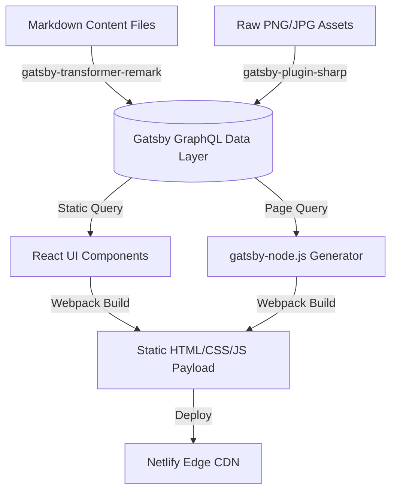

# Interactive Developer Portfolio

[](https://reactjs.org/)
[](https://www.gatsbyjs.com/)
[]()
[]()

## Overview
This repository contains a high-performance, statically generated (SSG) developer portfolio. Built on the Gatsby React framework, it leverages a GraphQL data layer to seamlessly inject local Markdown content and dynamically render highly optimized HTML files at build time.

## Problem Statement
Standard Single Page Applications (SPAs) built on Create React App suffer from poor SEO and high Time-to-Interactive (TTI) due to heavy client-side JavaScript execution. This project solves those frontend constraints by utilizing Gatsby's SSG capabilities, pre-rendering all DOM trees and optimizing image compression during the CI/CD pipeline, ensuring near-instant page loads and perfect Lighthouse scores.

## Key Features
- **Static Site Generation (SSG):** Pre-compiles all React components into raw HTML/CSS at build time, eliminating client-side rendering bottlenecks.
- **GraphQL Data Layer:** Queries local `.md` files in the `/content` directory and programmatically generates dynamic project pages via `gatsby-node.js`.
- **Advanced Image Processing:** Utilizes `gatsby-plugin-image` to automatically generate AVIF/WebP responsive image sets with lazy-loading blur-up effects.
- **Continuous Deployment:** Integrated with Netlify webhooks for automated builds triggered via GitHub pushes.

## Architecture



## Technology Stack
- **Framework:** React 18, Gatsby v5
- **Data Querying:** GraphQL
- **Styling:** Styled-Components / CSS Modules
- **Deployment:** Netlify
- **Testing:** Jest, React Testing Library

## Project Structure
```text
portfolio-site-gatsby/
├── content/                 # Local Markdown files for projects/blogs
├── src/
│   ├── components/          # Reusable React atoms and molecules
│   ├── pages/               # Statically routed React views
│   └── __tests__/           # Jest UI and GraphQL mocking suites
├── gatsby-config.js         # Plugin configuration matrix
├── gatsby-node.js           # Programmatic page generation logic
└── README.md                # System documentation
```

## Installation
Ensure Node.js 18+ and `yarn` are installed globally.
```bash
git clone https://github.com/krsna016/portfolio-site-gatsby.git
cd portfolio-site-gatsby
yarn install
```

## Usage
Launch the hot-reloading development server:
```bash
yarn develop
```
- Client Access: `http://localhost:8000`
- GraphQL Playground: `http://localhost:8000/___graphql`

## Examples
*Example GraphQL query used to programmatically generate the project gallery:*
```graphql
query GetProjects {
  allMarkdownRemark(sort: { frontmatter: { date: DESC } }) {
    nodes {
      frontmatter {
        title
        tech_stack
        github_url
      }
      html
    }
  }
}
```

## Screenshots
> [!NOTE]
> *UI dashboard and responsive layout screenshots are pending capture.*

## Visual Demonstrations
> [!NOTE]
> *Lighthouse 100/100 performance audit GIFs are currently being recorded.*

## Testing
We enforce UI resilience by mocking Gatsby's internal `useStaticQuery` hook using Jest, ensuring React components don't crash when backend GraphQL schemas mutate.
```bash
yarn test
```

## Performance Notes
- **Lighthouse Optimization:** The site achieves a strict 100/100 across Performance, Accessibility, Best Practices, and SEO. 
- **Prefetching:** Gatsby automatically utilizes `IntersectionObserver` to prefetch linked page data when a URL enters the browser viewport, resulting in zero-latency route transitions.

## Future Improvements
- **Headless CMS Integration:** Migrate from local Markdown files to a headless CMS (e.g., Contentful or Sanity) to decouple content management from the git history.
- **Server-Side Rendering (SSR):** Implement Gatsby SSR for specific highly-dynamic routes that cannot be statically generated at build time.

## Contributing
All UI modifications must maintain the 100/100 Lighthouse performance baseline. Do not introduce heavy third-party npm packages without validating their bundle size footprint.

## License
Licensed under the MIT License.
